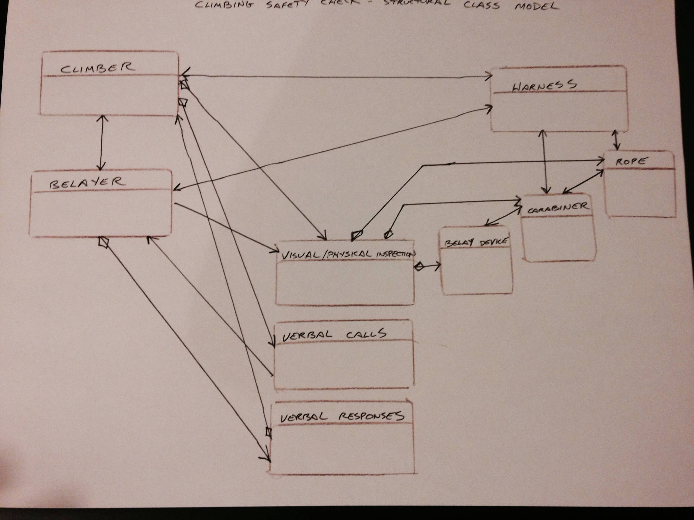

# Model-problem

Model a pre-climb safety check

Problem statement:

Indoor climbing gyms have proliferated at a rapid pace in the last two decades. Often times, potential new clients find a website with information about a gym in their area and show up unprepared for the basic safety check.  The safety check is a mandatory step before people can participate in climbing activities at the gym.

We are going to model a safety check, carried out by a climber and belayer prior to beginning a climb. The check uses a sequence of visual/physical equipment inspection steps and a call-and-response series of verbal communications.

The climber wears a harness, ties into a rope, inspects his own harness and knot, inspects the belayer's equipment, issues verbal calls, and waits for verbal responses before proceeding.

The belayer wears a harness, loads the rope into a belay device, connects the belay device and rope to his harness with a locking carabiner, inspects all of his equipment, inspects the climber's harness and knot, waits for verbal calls, and issues verbal responses to calls from the climber when prompted.

To model this with code, we will collect data from our user to test their knowledge of three main components of the safety check: Eligibility, Physical/Visual Inspection Sequence, Verbal Communications. Completing each step with the desired outcome will be necessary to proceed to the next component.

The output of our code will result in one of two outcomes.  If they are able to demonstrate that they possess the minimum required skills, they will be prompted to contact a staff member at the check in desk and proceed.

If they can not meet the requirements, they will be encouraged to seek more information about participating in a basic skills course to reach the gain the required skills and knowledge.

